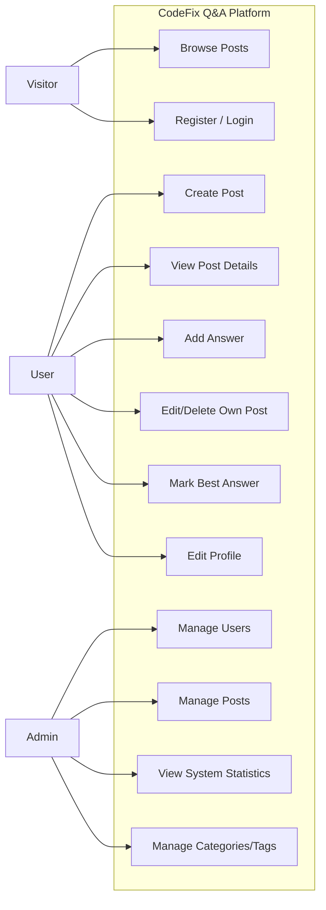

# CodeFix

A community platform for programmers to share coding errors and get help fixing them. Built with Vue 3, Vite, Vue Router, Pinia, and Tailwind CSS.

## Features

- **User Authentication**: Register, login, and manage user profiles with JWT tokens
- **Post Management**: Create, view, edit, and delete coding error posts
- **Answer System**: Reply to posts with solutions, vote on answers, and mark best answers
- **Search & Filter**: Find posts by keywords, tags, or author with pagination
- **User Profiles**: View and edit user profiles with role-based access control
- **Tag System**: Organize posts with tags and filter by tags
- **Voting System**: Upvote and downvote answers to help identify the best solutions
- **Internationalization**: Multi-language support (English, Arabic, Kurdish)
- **Responsive Design**: Works on desktop and mobile devices
- **Dark/Light Theme**: Toggle between light and dark modes
- **Loading States**: Comprehensive loading state management with composables
- **Error Handling**: Centralized error handling with user-friendly messages
- **Toast Notifications**: Success, error, warning, and info notifications
- **Real-time Updates**: Instant updates using Pinia state management
- **Admin Features**: Admin users can manage posts, users, and products

## Project Goals (Refined Version)

### 1. Build a Helpful Programming Community

Create an online space where developers can share their coding errors, get solutions, and help others in a collaborative environment.

### 2. Encourage Knowledge Sharing

Develop a platform that collects and organizes common programming problems and solutions, making it easier for users to learn from each other.

### 3. Provide a Simple and Clean User Experience

Design an easy-to-use, responsive interface that allows users to post questions, search, and answer quickly without confusion.

### 4. Enable Real-Time Interaction

Implement live updates for posts and answers using Vue and Pinia so users can see changes instantly without refreshing the page.

### 5. Support All Devices and Themes

Make the platform fully responsive on all screen sizes with both light and dark themes for better accessibility and comfort.

### 6. Ensure Secure and Smooth Performance

Use secure authentication, fast loading times, and modern technologies to keep the platform safe, efficient, and reliable.

### 7. Provide Administrative Control

Include an admin dashboard to help manage users, posts, and system activity effectively.

## Tech Stack

- **Vue 3** - Progressive JavaScript framework
- **Vite** - Fast build tool and development server
- **Vue Router** - Official router for Vue.js
- **Pinia** - State management for Vue
- **Vue I18n** - Internationalization plugin
- **TypeScript** - Type-safe JavaScript
- **Tailwind CSS** - Utility-first CSS framework
- **Axios** - HTTP client for API requests
- **Zod** - Schema validation
- **JSON Server** - Mock REST API server
- **JWT** - JSON Web Tokens for authentication
- **ESLint** - Code linting and formatting
- **Prettier** - Code formatting

## Project Structure

```plaintext
CodeFix/
├── src/
│   ├── components/          # Reusable Vue components
│   │   ├── AnswerCard.vue  # Answer/comment display component
│   │   ├── Navbar.vue      # Navigation bar with search and theme toggle
│   │   ├── TagPicker.vue   # Tag selection component
│   │   ├── PageHeader.vue  # Page header component
│   │   ├── PageFooter.vue  # Site footer component
│   │   └── layouts/        # Layout components
│   │       ├── DefaultLayout.vue
│   │       └── SimpleLayout.vue
│   ├── views/              # Page components (routes)
│   │   ├── HomeView.vue    # Home page with post listings
│   │   ├── PostdetailView.vue # Individual post detail view
│   │   ├── AddPostView.vue    # Create new post form
│   │   ├── Profileview.vue     # Current user profile page
│   │   ├── UserProfileView.vue # View other user profiles
│   │   ├── LoginView.vue       # Login form
│   │   ├── Signupview.vue      # Registration form
│   │   └── SupportView.vue     # Support page
│   ├── stores/             # Pinia stores
│   │   ├── authStore.ts    # Authentication state management
│   │   └── postsStore.ts   # Posts and comments state management
│   ├── services/           # API service layer
│   │   ├── api.ts          # Axios instance with interceptors
│   │   ├── authService.ts  # Authentication endpoints
│   │   ├── postService.ts  # Post CRUD operations
│   │   ├── commentService.ts # Comment operations
│   │   ├── userService.ts  # User operations
│   │   ├── tagService.ts   # Tag operations
│   │   ├── productService.ts # Product operations (legacy)
│   │   └── index.ts        # Central service exports
│   ├── composables/        # Vue composables
│   │   ├── useLoadingState.ts # Loading state management
│   │   ├── useErrorState.ts   # Error state management
│   │   └── useToast.ts         # Toast notification system
│   ├── types/              # TypeScript type definitions
│   │   ├── api.types.ts    # API request/response types
│   │   └── entities.ts     # Entity type definitions
│   ├── router/             # Vue Router configuration
│   │   └── index.ts        # Route definitions and guards
│   ├── i18n/               # Internationalization
│   │   ├── index.ts        # i18n configuration
│   │   ├── en.json         # English translations
│   │   ├── ar.json         # Arabic translations
│   │   └── ku.json         # Kurdish translations
│   ├── assets/             # Static assets
│   │   └── styles/         # Global styles
│   │       └── styles.css  # Global styles and Tailwind imports
│   ├── data/               # Sample data
│   │   └── sampleData.json
│   ├── App.vue             # Root component
│   ├── main.ts             # Application entry point
│   └── env.d.ts            # TypeScript environment declarations
├── server/                 # JSON Server backend
│   ├── index.js            # Server implementation with auth
│   └── package.json        # Server dependencies
├── composables/            # Root-level composables (shared)
│   ├── useLoadingState.ts
│   ├── useErrorState.ts
│   └── useToast.ts
├── components/             # Root-level components (shared)
│   ├── LoadingSpinner.vue
│   ├── ToastNotification.vue
│   └── ExampleUsage.vue
├── docs/                   # Documentation
│   ├── API_ABSTRACTION.md
│   └── LOADING_ERROR_UI.md
├── db.json                 # JSON Server database
├── server.cjs              # Server entry point
├── package.json            # Frontend dependencies
└── README.md               # This file
```

## Getting Started

### Prerequisites

- Node.js (version 16 or higher)
- npm or yarn package manager

### Installation

1. **Clone the repository**

```bash
   git clone <repository-url>
   cd CodeFix-project
```

2. **Install dependencies**

```bash
   npm install
```

3. **Start the development server**

```bash
npm run dev
```

4. **Open your browser**

Navigate to `http://localhost:5173` to view the application.

### Available Scripts

- `npm run dev` - Start development server (frontend only)
- `npm run server` - Start JSON Server backend
- `npm run dev:all` - Start both frontend and backend simultaneously
- `npm run build` - Build for production (includes type checking)
- `npm run preview` - Preview production build
- `npm run test:unit` - Run unit tests with Vitest
- `npm run type-check` - Run TypeScript type checking
- `npm run lint` - Run ESLint for code linting
- `npm run format` - Format code with Prettier

## Usage

### For Users

1. **Register/Login**: Create an account or sign in to access all features
2. **Browse Posts**: View recent coding errors and solutions on the home page
3. **Search**: Use the search bar to find posts by keywords or tags
4. **Create Posts**: Share your coding errors with the community
5. **Answer Posts**: Help others by providing solutions to their problems
6. **Vote on Answers**: Upvote helpful answers and downvote incorrect ones
7. **Mark Best Answers**: Post owners can mark the most helpful answer
8. **Edit Profile**: Update your profile information and settings
9. **View User Profiles**: Browse other users' profiles and their posts

### For Developers

The application uses a component-based architecture with:

- **Reactive State Management**: Pinia stores for global state (authStore, postsStore)
- **Service Layer**: Centralized API services (no raw Axios in components)
- **Composables**: Reusable composables for loading, errors, and toasts
- **Type Safety**: Full TypeScript support with type definitions
- **Internationalization**: Vue I18n for multi-language support
- **Component Communication**: Props and events for data flow
- **Routing**: Vue Router with authentication guards
- **Styling**: Tailwind CSS for responsive design
- **Code Quality**: ESLint and Prettier for consistent code style
- **Testing**: Vitest for unit testing

### Development Guidelines

- **API Calls**: Always use service layer (`src/services/`) - never use Axios directly in components
- **State Management**: Use Pinia stores for global state, local state for component-specific data
- **Loading States**: Use `useLoadingState` composable for loading indicators
- **Error Handling**: Use `useErrorState` composable and `useToast` for user feedback
- **Type Safety**: Always use TypeScript types from `src/types/`
- **Internationalization**: Use `$t()` for all user-facing text

## Key Features Implementation

### State Management

- **Pinia Stores**: Centralized state with `authStore` and `postsStore`
- **Reactive Data**: Vue 3 Composition API with reactive refs and computed properties
- **Local Storage**: JWT token persistence for user sessions
- **State Synchronization**: Automatic state updates after API calls

### Routing

- **Protected Routes**: Authentication guards for routes requiring login
- **Dynamic Routes**: Route parameters for post details and user profiles
- **Navigation Guards**: Automatic redirects for authenticated/unauthenticated users
- **Lazy Loading**: Code-split route components for better performance

### API Architecture

- **Service Layer**: All API calls abstracted through service modules
- **Axios Interceptors**: Automatic token injection and error handling
- **Type Safety**: Full TypeScript types for all API requests and responses
- **Error Handling**: Centralized error handling with user-friendly messages

### UI/UX

- **Responsive Design**: Mobile-first approach with Tailwind CSS
- **Theme Toggle**: Dark/light theme with system preference detection
- **Loading States**: Multiple concurrent loading states with `useLoadingState`
- **Error States**: Contextual error messages with `useErrorState`
- **Toast Notifications**: Success, error, warning, and info toasts
- **Internationalization**: Multi-language support with Vue I18n
- **Accessibility**: Accessible form controls and navigation

### Composables

- **useLoadingState**: Manage multiple concurrent loading states
- **useErrorState**: Handle and display error messages
- **useToast**: Show toast notifications with different types

### Data Flow

- **Service → Store → Component**: Data flows through services to stores to components
- **Event-Driven**: Component events trigger store actions
- **Reactive Updates**: Automatic UI updates when store state changes

## Browser Support

- Chrome (latest)
- Firefox (latest)
- Safari (latest)
- Edge (latest)

## Contributing

1. Fork the repository
2. Create a feature branch (`git checkout -b feature/amazing-feature`)
3. Commit your changes (`git commit -m 'Add some amazing feature'`)
4. Push to the branch (`git push origin feature/amazing-feature`)
5. Open a Pull Request

## License

This project is licensed under the MIT License - see the LICENSE file for details.

## Supports

For support, email support@codefix.dev or create an issue in the repository.
## UseCases


